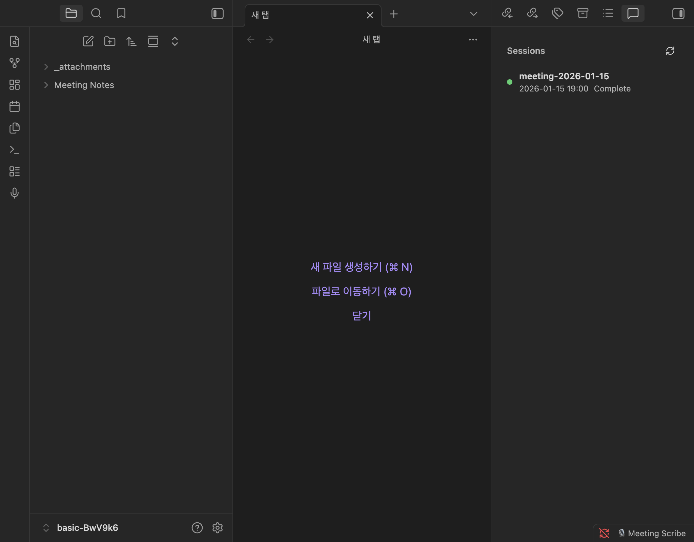
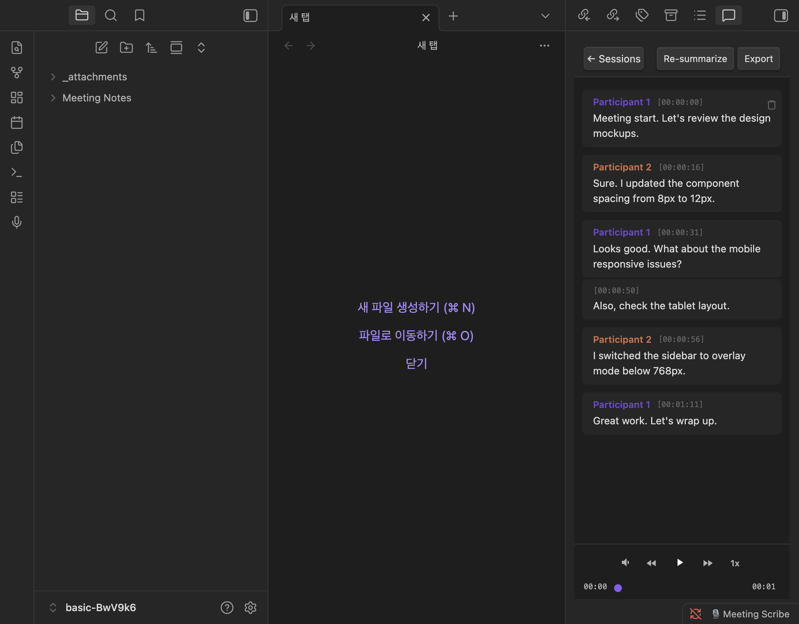
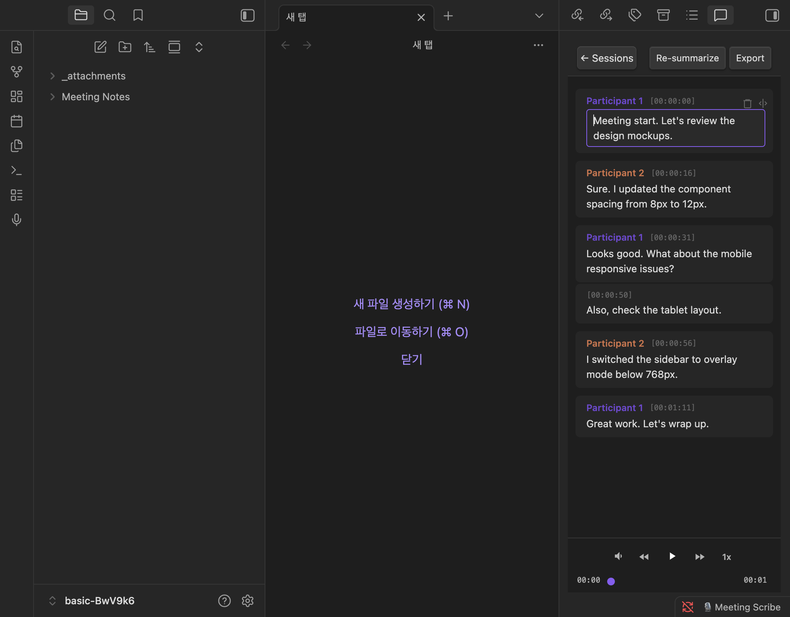
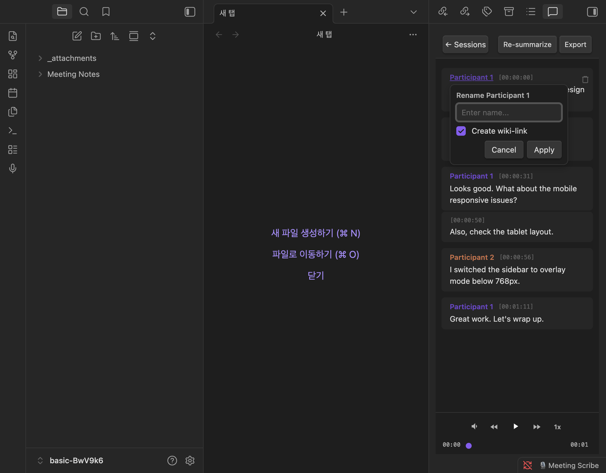
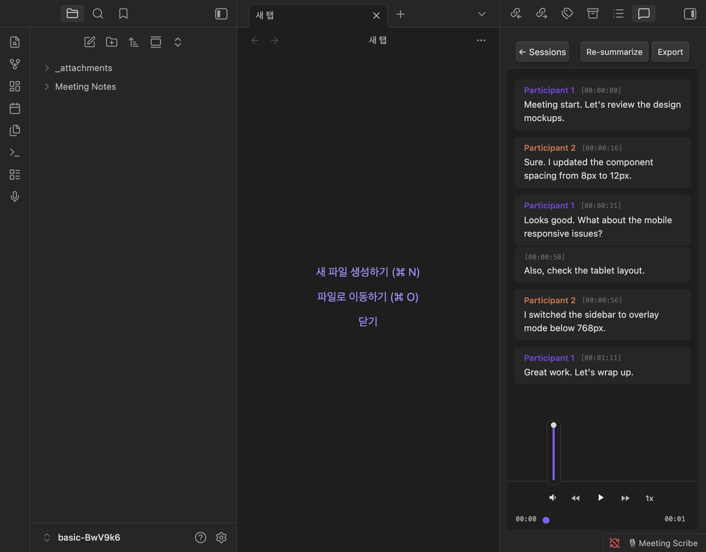
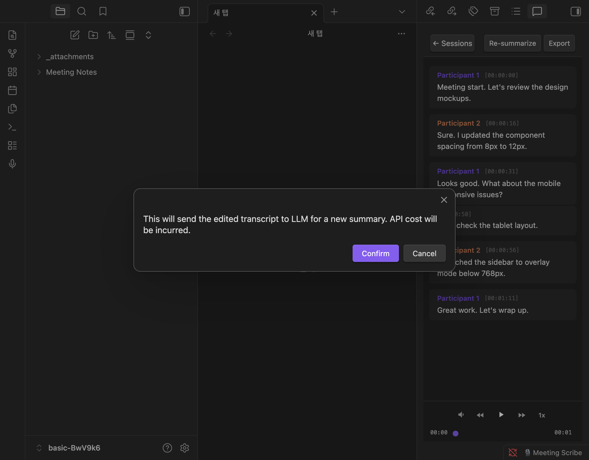
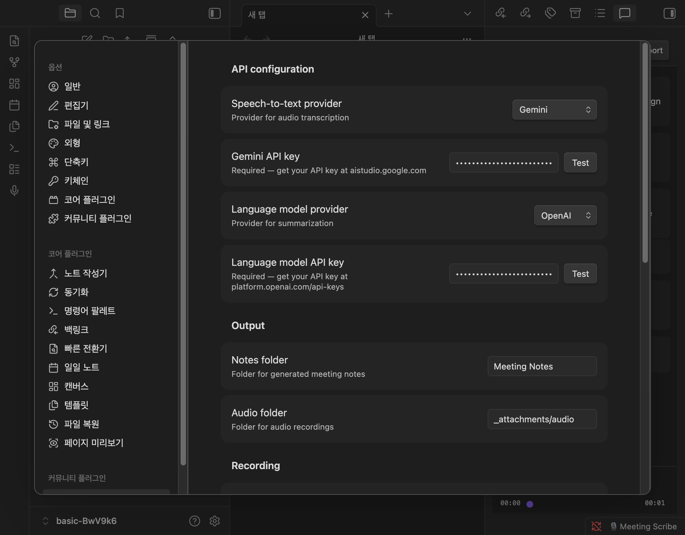

# Meeting Scribe

Record meetings, transcribe with cloud STT, summarize with LLM, and auto-generate structured meeting notes.

## Features

- **One-click recording** — Start/stop with a ribbon icon, status bar, or command palette
- **Cloud STT transcription** — OpenAI Whisper, CLOVA Speech, or Gemini
- **LLM summarization** — OpenAI or Anthropic Claude generate structured summaries
- **Transcript sidebar** — Interactive chat-bubble view with audio playback sync
- **Inline editing** — Edit transcription text, timestamps, and speaker names directly
- **Speaker mapping** — Rename speakers to real names with vault note autocomplete and wiki-links
- **Re-summarize** — Regenerate summaries after editing the transcript
- **Export** — Export edited transcripts to Markdown
- **Import audio** — Process existing audio files from your vault
- **Recording formats** — WebM, M4A, or WAV (configurable)
- **BYOK** — Bring your own API keys. No intermediary servers, no subscriptions

## Screenshots

### Session list & Transcript view
| Sessions | Transcript |
|----------|-----------|
|  |  |

### Editing & Speaker mapping
| Inline editing | Speaker mapping |
|---------------|----------------|
|  |  |

### Audio player & Re-summarize
| Volume control | Re-summarize |
|---------------|-------------|
|  |  |

### Settings

## How it works

1. Press the ribbon icon or use the command palette to **start recording**
2. **Stop recording** when your meeting ends
3. The plugin processes your audio in the background:
   - Transcribes speech to text via cloud STT
   - Summarizes the transcript with an LLM
   - Generates a structured meeting note in your vault
4. The **transcript sidebar** opens automatically with an interactive view
5. Edit transcription errors, rename speakers, and re-summarize as needed

## Setup

1. Install the plugin from Obsidian community plugins
2. Open Settings and enter your API keys:
   - **STT**: [OpenAI](https://platform.openai.com/api-keys), [CLOVA Speech](https://www.ncloud.com/product/aiService/clovaSpeech), or [Gemini](https://aistudio.google.com/apikey)
   - **LLM**: [OpenAI](https://platform.openai.com/api-keys) or [Anthropic](https://console.anthropic.com/settings/keys)
3. Click **Run test** to verify your setup
4. Start recording

## Settings

| Setting | Description | Default |
|---------|-------------|---------|
| STT provider | Speech-to-text service (OpenAI, CLOVA Speech, Gemini) | OpenAI |
| STT model | Transcription model | gpt-4o-mini-transcribe |
| STT language | Transcription language | Auto-detect |
| LLM provider | Summarization service (OpenAI, Anthropic) | Anthropic |
| Summary language | Language for generated summaries | Auto-detect |
| Notes folder | Where meeting notes are saved | Meeting Notes |
| Audio folder | Where recordings are stored | _attachments/audio |
| Recording format | Audio format for recordings (WebM, M4A, WAV) | WebM |
| Audio retention | Keep or delete audio after processing | Keep |
| Include transcript | Append full transcript in generated notes | On |
| Separate transcript file | Create a separate transcript Markdown file | Off |
| Enable summary | Generate LLM summary (disable for transcript-only) | On |
| Auto-open sidebar | Open transcript sidebar when a meeting note is active | On |
| Consent reminder | Show recording consent notice before starting | On |

## Commands

| Command | Description |
|---------|-------------|
| Start recording | Begin audio recording |
| Stop recording | Stop recording and start processing |
| Toggle recording | Start or stop recording |
| Import audio file | Process an existing audio file |
| Open transcript sidebar | Open the interactive transcript view |
| Audio play/pause | Play or pause audio playback |
| Audio skip back | Skip back 5 seconds |
| Audio skip forward | Skip forward 5 seconds |

## Transcript sidebar

The sidebar provides an interactive workspace for your transcripts:

- **Chat bubbles** — Each speaker segment displayed as a colored bubble with timestamp
- **Click to seek** — Click any timestamp to jump to that point in the audio
- **Inline editing** — Click bubble text to edit transcription errors
- **Delete/Split** — Hover to reveal delete and split buttons (split available in edit mode)
- **Speaker mapping** — Click a speaker name to rename with vault autocomplete
- **Wiki-links** — Link speaker names to existing vault notes
- **Re-summarize** — Regenerate the summary after edits (uses LLM API)
- **Export** — Export the transcript as a Markdown file
- **Playback sync** — Current segment highlights during audio playback
- **Keyboard shortcuts** — Configurable hotkeys for play/pause, skip forward/back

## Requirements

- Obsidian v0.15.0+
- API key for at least one STT provider
- API key for at least one LLM provider (optional if summary disabled)
- Microphone access (for recording; not needed for audio import)

## Privacy

This plugin uses your own API keys to connect directly to provider APIs. No data passes through intermediary servers. Audio and transcripts are sent only to the provider you configure. Your vault data stays local.

## License

[MIT](LICENSE)
